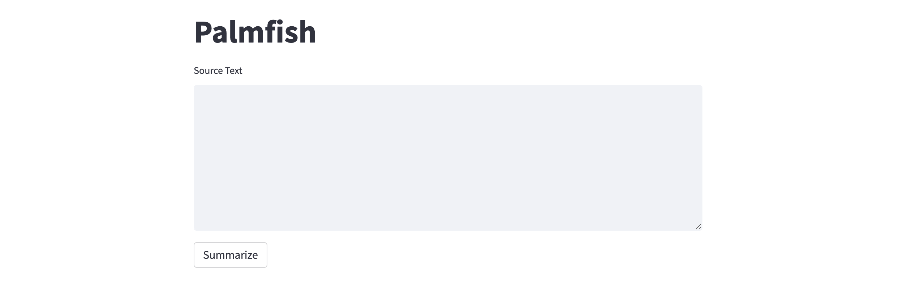

# google-palm
Getting started with the Google Cloud Vertex AI PaLM API.

### Question Answering with Google PaLM API

### Text Summarization with Google PaLM API

To deploy on [Railway](https://railway.app/?referralCode=alphasec) using a one-click template, click the button below.

To open the Python notebook in Google Colab, click the button below.

