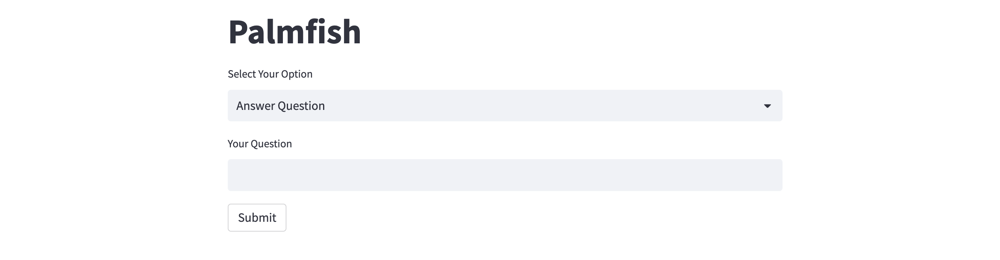
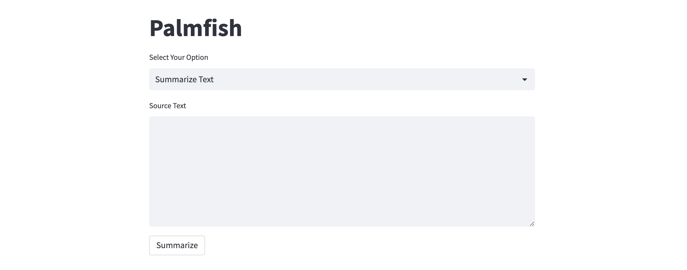

# google-cloud-palm-api
[PaLM 2](https://ai.google/discover/palm2), Google's next-generation large language model (LLM), has an improved model architecture and excels at advanced reasoning tasks like code and math, text classification, question answering, translation, and natural language generation better than previous LLMs including PaLM. PaLM 2 was evaluated rigorously for harms and biases, and is being used in other state-of-the-art (SOTA) models like [Med-PaLM 2](https://sites.research.google/med-palm/) and [Sec-PaLM](https://cloud.google.com/blog/products/identity-security/rsa-google-cloud-security-ai-workbench-generative-ai). It also powers Google [Bard](https://bard.google.com/), [MakerSuite](https://developers.generativeai.google/products/makersuite), and the PaLM API. In [this](https://alphasec.io/getting-started-with-google-cloud-vertex-ai-palm-api) blog post, I explore use cases like question-answering and text summarization, and build a simple Streamlit app to play with it.

### Question Answering with PaLM API
In this section of the notebook, we explore question-answering with PaLM API. Similar to other LLM providers like OpenAI, you can use zero-shot prompts, few-shot prompts, and provide additional domain knowledge as context. This notebook shows a simple zero-shot prompt example using a Streamlit app, and the `text-bison@001` text generation model.

### Text Summarization with PaLM API
In this section of the notebook, we explore text summarization with PaLM API. There are two main summarization types - extractive and abstractive. This notebook shows a simple summarization example using a Streamlit app, and the `text-bison@001` text generation model.

To deploy on [Railway](https://railway.app/?referralCode=alphasec) using a one-click template, click the button below.

To open the Python notebook in Google Colab, click the button below.

*Disclaimer: This is not an officially supported Google or Google Cloud project; it is a personal project created for educational and experimental purposes.*
