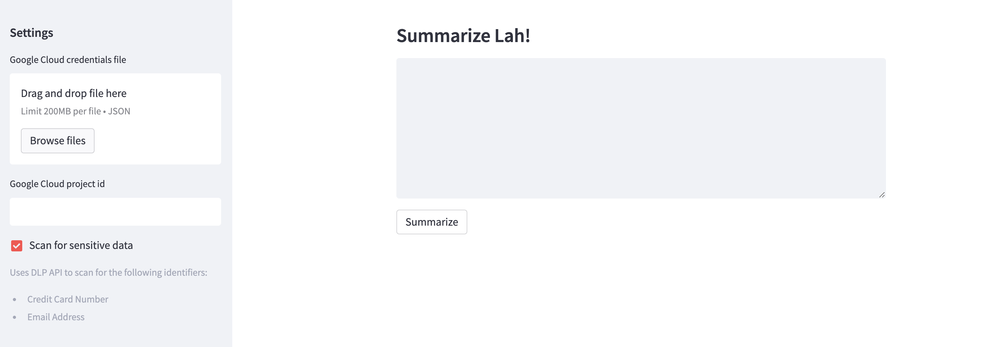

# google-cloud-palm-dlp-api

[PaLM 2](https://ai.google/discover/palm2), Google's next-generation large language model (LLM), has an improved model architecture and excels at advanced reasoning tasks like code and math, text classification, question answering, translation, and natural language generation better than previous LLMs including PaLM. PaLM 2 was evaluated rigorously for harms and biases, and is being used in other state-of-the-art (SOTA) models like [Med-PaLM 2](https://sites.research.google/med-palm/) and [Sec-PaLM](https://cloud.google.com/blog/products/identity-security/rsa-google-cloud-security-ai-workbench-generative-ai). It also powers Google [Bard](https://bard.google.com/), [MakerSuite](https://developers.generativeai.google/products/makersuite), and the PaLM API.

[Cloud Data Loss Prevention](https://cloud.google.com/dlp) (Cloud DLP for short) is a fully managed Google Cloud service designed to help you discover, classify, and protect sensitive data. You can gain visibility into sensitive data risk across your entire organization, reduce data risk with obfuscation and de-identification methods like masking and tokenization, and seamlessly inspect and transform structured and unstructured data.

### Sensitive Data Inspection with DLP API
In this example, we explore text summarization with PaLM API, but only after a sensitive data inspection scan for `CREDIT_CARD_NUMBER` and `EMAIL_ADDRESS` returns negative. You'll need the following:
* A Google Cloud project with `Vertex AI API` and `Data Loss Prevention API` enabled.
* A Google Cloud service account with `Vertex AI User`, `DLP User`, and `Service Usage Admin` roles assigned.
* The service account credentials file (JSON).

*Disclaimer: This is not an officially supported Google or Google Cloud project; it is a personal project created for educational and experimental purposes.*
