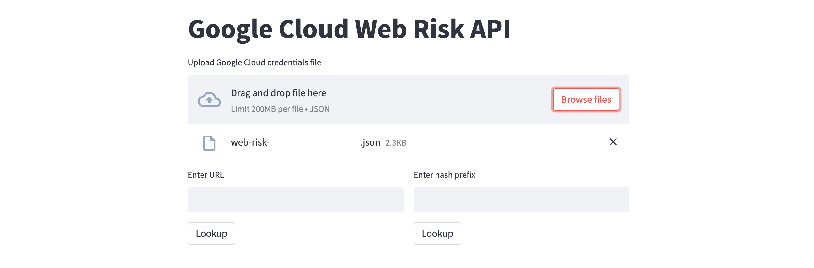

# google-cloud-web-risk-api
A sample Streamlit web application for querying Google Cloud Web Risk Lookup API.

[Google Safe Browsing](https://safebrowsing.google.com) is a free service from Google that warns users when they try to visit a dangerous website or download a malicious file. [Google Cloud Web Risk](https://cloud.google.com/web-risk) is effectively the "Enterprise" edition of Safe Browsing. It extends Safe Browsing capabilities to use the APIs at higher volumes, offers access to enterprise features like risk scoring, confidence levels, file/attachment reputation coverage, and integrates with Google Cloud security and analytics tools.

For a detailed guide, see [this](https://alphasec.io/safe-browsing-with-google-cloud-web-risk) post. To deploy on [Railway](https://railway.app/?referralCode=alphasec) using a one-click template, click the button below.

